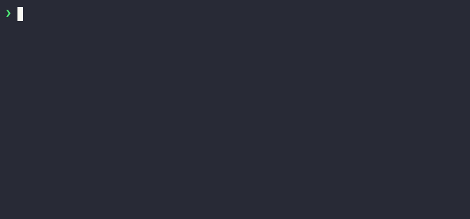

# Hatch v1.10.0

Hatch [v1.10.0](https://github.com/pypa/hatch/releases/tag/hatch-v1.10.0) brings a test command, support for UV, and a Python script runner.

<!-- more -->

## Test command

The new [`test`](../../cli/reference.md#hatch-test) command allows you to easily run tests for your project on multiple versions of Python. The default behavior follows best practices, using [pytest](https://github.com/pytest-dev/pytest) with select plugins for test execution and [coverage.py](https://github.com/nedbat/coveragepy) for code coverage measurement.

The command is designed to be both simple to use while also satisfying the needs of most projects. For example, the following shows Hatch running tests for [Jinja](https://github.com/pallets/jinja) in all environments in the [default matrix](../../config/internal/testing.md#matrix):

<figure markdown>
  { loading=lazy role="img" }
</figure>

Here is us testing [Rich](https://github.com/Textualize/rich), with a bit of configuration:

<figure markdown>
  { loading=lazy role="img" }
</figure>

See the [tutorial](../../tutorials/testing/overview.md) for a detailed walk-through and the [config reference](../../config/internal/testing.md) for options.

## UV

The package installer [UV](https://github.com/astral-sh/uv), brought to you by the same folks behind [Ruff](https://github.com/astral-sh/ruff), is now supported. In any environment, you can set the `installer` option to `uv` to use UV in place of [virtualenv](https://github.com/pypa/virtualenv) & [pip](https://github.com/pypa/pip) for virtual environment creation and dependency management, respectively. This often results in a significant performance benefit.

For example, if you wanted to enable this functionality for the [default](../../config/environment/overview.md#inheritance) environment, you could set the following:

```toml config-example
[tool.hatch.envs.default]
installer = "uv"
```

Semi-internal environments like those used for [testing](../../config/internal/testing.md) and [static analysis](../../config/internal/static-analysis.md) have this UV enabled by default.

See the [how-to guide](../../how-to/environment/select-installer.md) for more information about switching the installer.

## Python script runner

The [`run`](../../cli/reference.md#hatch-run) command now supports executing Python scripts with [inline metadata](https://packaging.python.org/en/latest/specifications/inline-script-metadata/) as standardized by [PEP 723](https://peps.python.org/pep-0723/).

As an example, consider the following script:

```python tab="script.py"
# /// script
# requires-python = ">=3.11"
# dependencies = [
#   "httpx",
#   "rich",
# ]
# ///

import httpx
from rich.pretty import pprint

resp = httpx.get("https://peps.python.org/api/peps.json")
data = resp.json()
pprint([(k, v["title"]) for k, v in data.items()][:10])
```

If you run the script for the first time as follows:

```
hatch run script.py
```

Hatch will create a dedicated environment for that script using a version of Python greater than or equal to 3.11 with dependencies `httpx` and `rich`.

<figure markdown>
  { loading=lazy role="img" }
</figure>

See the [how-to guide](../../how-to/run/python-scripts.md) for more information.

## Static analysis

The environment used for static analysis is now [completely configurable](../../config/internal/static-analysis.md#customize-behavior) such that you can fully alter the underlying behavior of the [`fmt`](../../cli/reference.md#hatch-fmt) command (see the [how-to](../../how-to/static-analysis/behavior.md)).

Additionally, Ruff has been updated to version 1.4.0 and the rules selected by default have been updated accordingly. Check out their [blog post](https://astral.sh/blog/ruff-v0.4.0) about how the new hand-written parser has made it twice as fast!

## Community highlights

### Visual Studio Code

Visual Studio Code [announced support](https://code.visualstudio.com/updates/v1_88#_hatch-environment-discovery) for Hatch environments in their latest release. This means that you can now easily discover and select Hatch environments for your projects directly from the editor.

See the [how-to guide](../../how-to/integrate/vscode.md) detailed instructions.

### CMake build plugin

A [new release](https://github.com/scikit-build/scikit-build-core/releases/tag/v0.9.0) of the extension module builder [scikit-build-core](https://github.com/scikit-build/scikit-build-core) has introduced a [build plugin](https://scikit-build-core.readthedocs.io/en/stable/plugins/hatchling.html) for Hatchling. This means that you can use Hatchling as your build backend while also shipping extension modules built with CMake.

To get started, add the dependency to your [build requirements](../../config/build.md#build-system):

```toml tab="pyproject.toml"
[build-system]
requires = ["hatchling>=1.24.2", "scikit-build-core~=0.9.3"]
build-backend = "hatchling.build"
```

Then explicitly enable the `experimental` option (acknowledging that the plugin will move to a dedicated package in the future):

```toml config-example
[tool.hatch.build.targets.wheel.hooks.scikit-build]
experimental = true
```

At this point, you can create your `CMakeLists.txt` file as usual and start building your extension modules with CMake! Check out the dedicated [example project](https://github.com/scikit-build/scikit-build-sample-projects/tree/main/projects/hatchling-pybind11-hello) for a complete demonstration.
